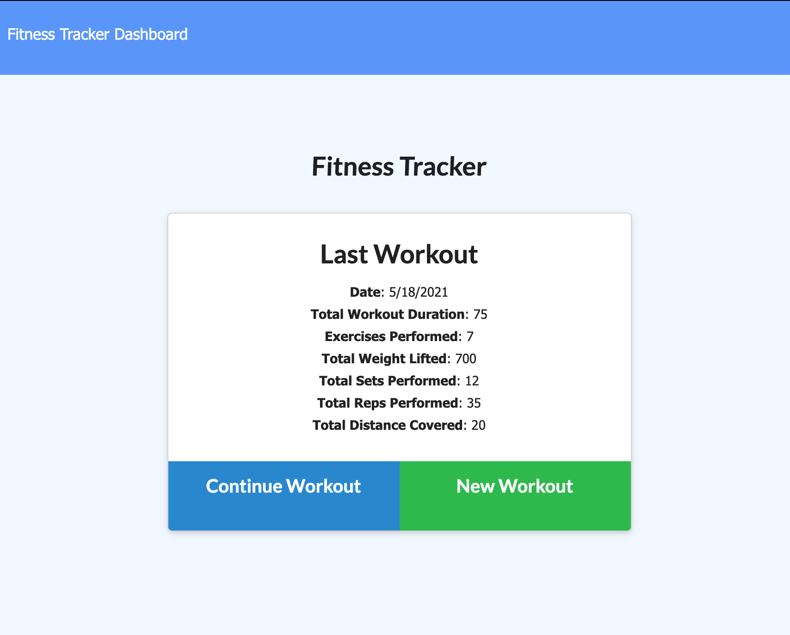
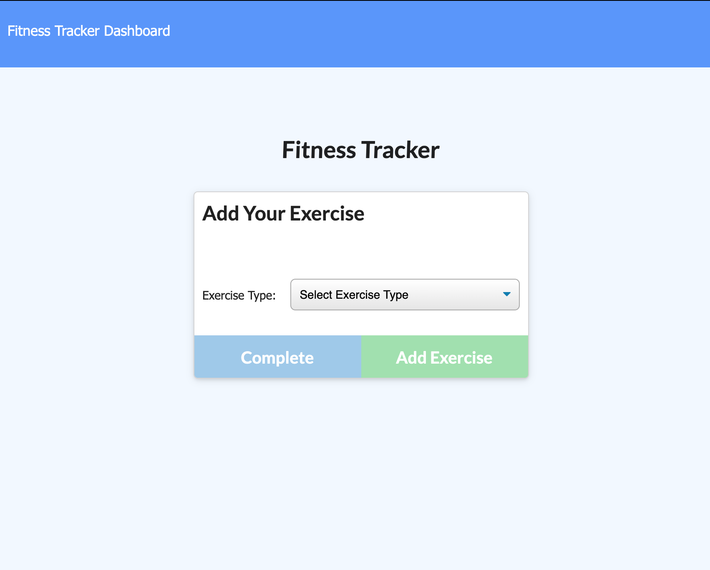
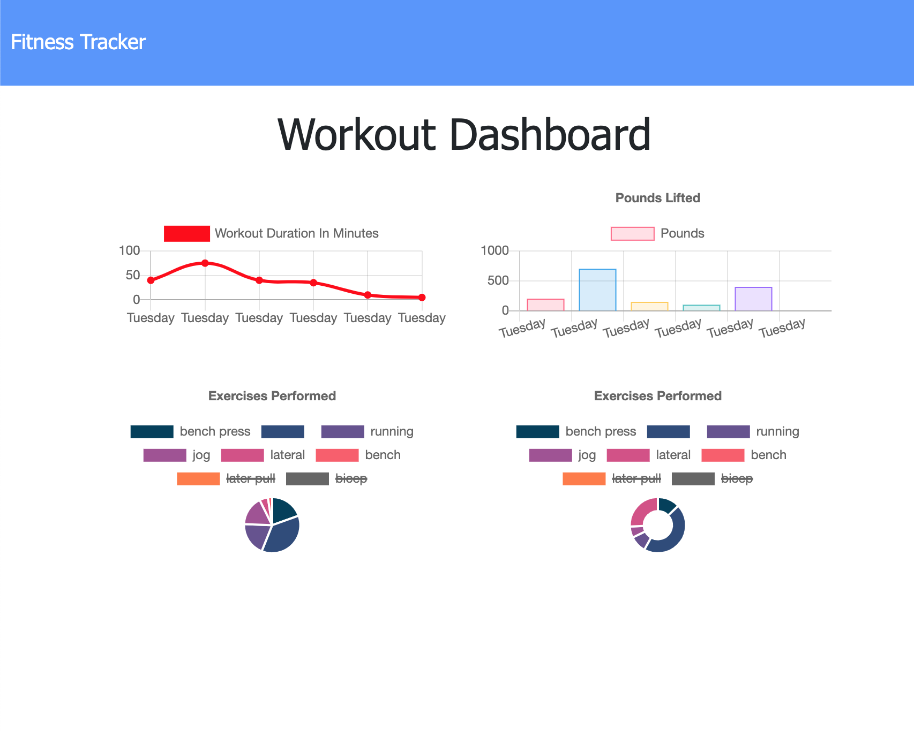

# FitnessTracker

## Description

For this assignment, create a workout tracker. You have already been provided with the front end code. This assignment will require you to create Mongo database with a Mongoose schema and handle routes with Express.

As a user, I want to be able to view, create and track daily workouts. I want to be able to log multiple exercises in a workout on a given day. I should also be able to track the name, type, weight, sets, reps, and duration of exercise. If the exercise is a cardio exercise, I should be able to track my distance traveled.

## Licensing

## Technologies Used

* Express
* NoSql - MongoDB
* Mongoose

## Usage

When the user loads the page, they should be given the option to create a new workout or continue with their last workout.

The user should be able to:

  * Add exercises to the most recent workout plan.

  * Add new exercises to a new workout plan.

## Demo

Deployed Heroku application: https://fittrackerr.herokuapp.com

## Screenshots

When the user loads the page, they are given the option to create a new workout or continue with their last workout.

The user can add exercises to the most recent workout plan or add new exercises to a new workout plan.

The user, can view, create and track daily workouts.

## Contact

You can follow my repositories at https://www.github.com/srad25
